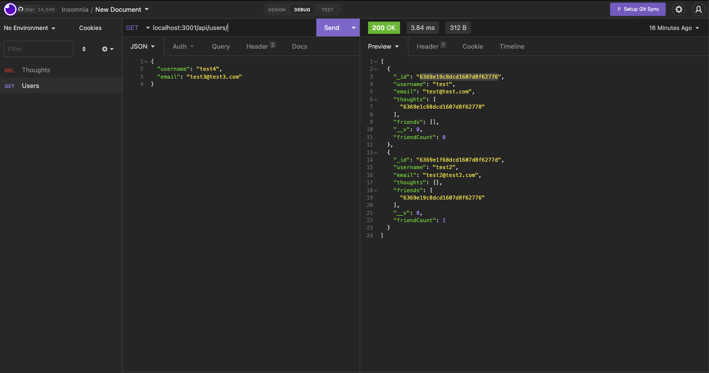
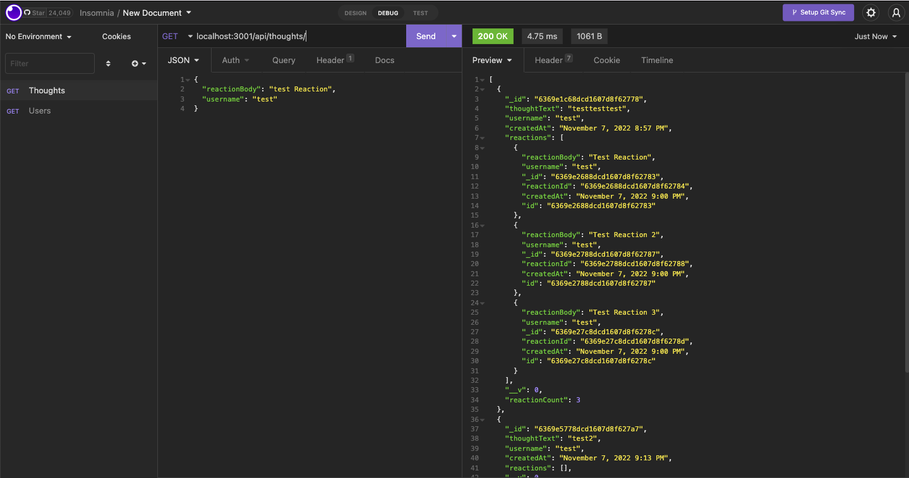

# C18_Social_API

## Table-of-Contents
  * [Description](#description)
  * [Installation](#installation)
  * [Usage](#usage)
  * [Contributing](#contributing)
  * [Tests](#tests)
  * [Questions](#questions)
  * [Links](#links)
 
  ## Description
  This challenge was to build an API for a social network web application using Express.js for routing, a MongoDB database, and the Mongoose ODM. 

  ## Installation
  Use the following routes 

  Users:
  - GET / POST USERS - localhost:3001/api/users
    - To add a user, include the following parameters: "username", "email"
  - GET / PUT / DELETE A SINGLE USER BY ID - localhost:3001/api/users/:userId
  - POST / DELETE FRIENDS - localhost:3001/api/users/:userId/friends/:friendId

  Thoughts:
  - GET / POST THOUGHTS - localhost:3001/api/thoughts
    - To add a thought and associate it with a user, include the following parameters: "thoughtText", "username", "userId"
  - GET / PUT / DELETE A SINGLE THOUGHT BY ID - localhost:3001/api/thoughts/:thoughtId
  - POST REACTION - localhost:3001/api/thoughts/:thoughtId/reactions
    - To add a reaction, include the following parameters: "reactionBody", "username"
  - DELETE REACTION BY ID - localhost:3001/api/thoughts/:thoughtId/reactions/:reactionId

  ## Usage
  N/A

  ## Contributing
  Currently, I am not accepting contributors for this project

  ## Tests
  N/A

  ## Questions
  For any questions, please reach out to me at the following:
  - GitHub: https://github.com/ahuang23
  - Email: a.huang232@gmail.com

  ## Example
  
  

  ## Links
  [GitHub](https://github.com/ahuang23/C18_Social_API)
  [Video Walk Through](https://watch.screencastify.com/v/EpTFbYQqRTOdSOOtroYU)
